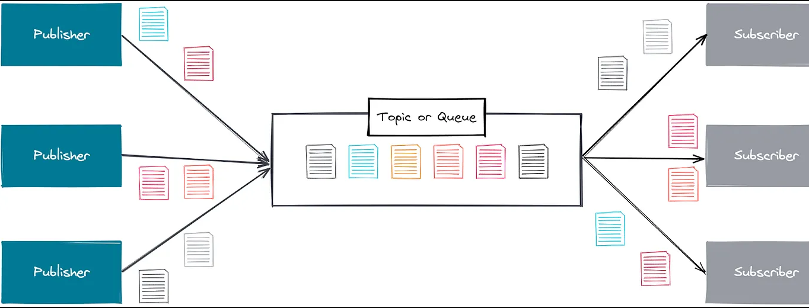

<div align="center">

 # Pub/Sub with Spring and Kafka

 

</div>

## Technologies

- [Spring Boot](https://spring.io/projects/spring-boot)
- [Spring MVC](https://docs.spring.io/spring-framework/reference/web/webmvc.html)
- [Spring for Kafka](https://docs.spring.io/spring-kafka/reference/html/)
- [Kafka](https://kafka.apache.org)
- [Zookeeper](https://zookeeper.apache.org/)
- [Docker Compose](https://docs.docker.com/compose/)

## Test

- Clone the repository
- With docker and docker-compose installed, navigate to the project directory, open your terminal and type the following command:

```bash
docker-compose up
```

- Start the application
- Send the request passing <i>name</i> in the path that will be the message received sysout:

```bash
curl -X GET http://localhost:8080/kafka/hello/maxjdev
```

- Message received:

```
Consumer message: Hello maxjdev
```
